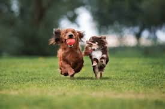

# ImageCaptionRecognizer

dataset - Flickr8k: https://github.com/jbrownlee/Datasets/releases

encoder model used: MobileNetV3-Large-based, freezed features &  learnable FC (960, embedding_size)

decoder model used: LSTM with 2 variants of (embedding_size, hidden_size, num_layers) combinations.

### test subset results for decoders:
1) embedding = 256; hidden = 512 layers = 3

performing testing...

bleu: 0.16702355444431305; bert: {'f1': 0.6866761445999146, 'precision': 0.6868309378623962, 'recall': 0.6886590123176575}

2) embedding = 256; hidden = 256 layers = 2

performing testing...

bleu: 0.1565232127904892; bert: {'f1': 0.6901417970657349, 'precision': 0.6910170316696167, 'recall': 0.6915327310562134}

### extra testing with own set of downloaded images
see own_set folder for inputs.

People cycling            | Dogs playing  |  People traveling
:-------------------------:|:-------------------------:|:-------------------------:
  |   | 

testing result for model 1:

testing result for model 2:

